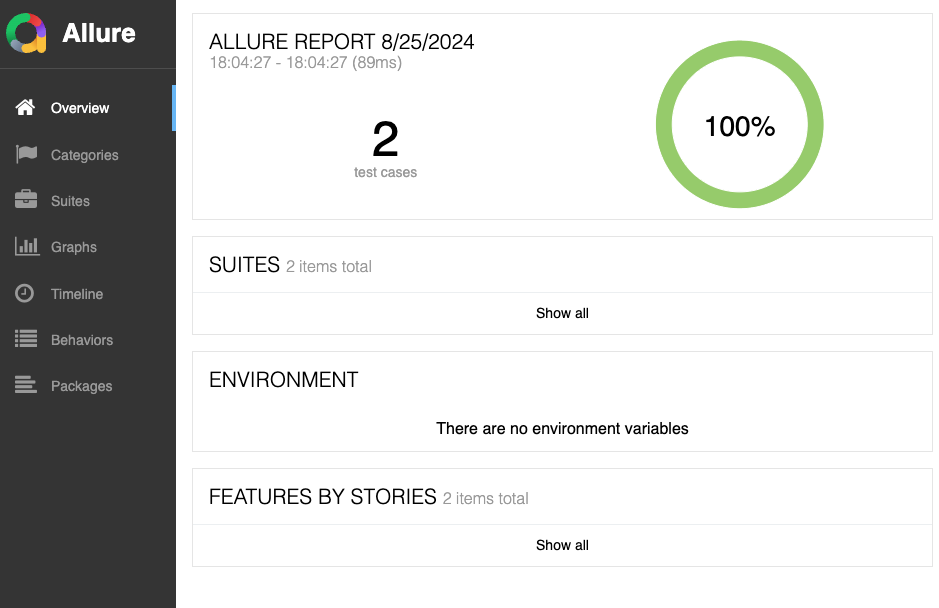

# qa-backend-code-challenge

Code challenge for QA Backend Engineer candidates.

### Build Docker image

Run this command from the directory where there is the solution file.

```
docker build -f src/Betsson.OnlineWallets.Web/Dockerfile .
```

### Run Docker container

```
docker run -p <port>:8080 <image id>
```

### Open Swagger

```
http://localhost:<port>/swagger/index.html
```

### Api Testing

Api testing solution will be generating an Allure Report after finishing the execution you have to have Allure commandline installed:

```
https://allurereport.org/docs/install/
```

After running the API tests normally with dotnet test the report needs to be generated using the results, in Betsson.OnlineWallets.Api.Tests folder just follow the steps:

### Running the API tests project:

First check in src/Betsson.OnlineWallets.Api.Tests/appsettings.json if you are running the Online Wallet on the same host and port as configured there:

```
{
    "OnlineWallet": {
        "BaseUrl": "http://localhost:5047"
    }
}
```

For feature pipeline implementation we can create an appsettings.local.json and setup the host and port accordingly.

After checking the host and port you will be able to run the API automation:

```
dotnet test
```

### After running the API tests you will be able to serve or generate Allure Report:

```
allure serve bin/Debug/net8.0/allure-results
```

```
allure generate bin/Debug/net8.0/allure-results
```

