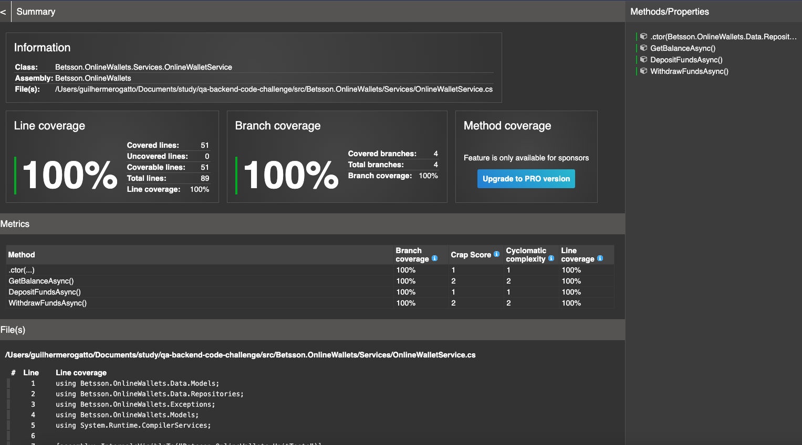
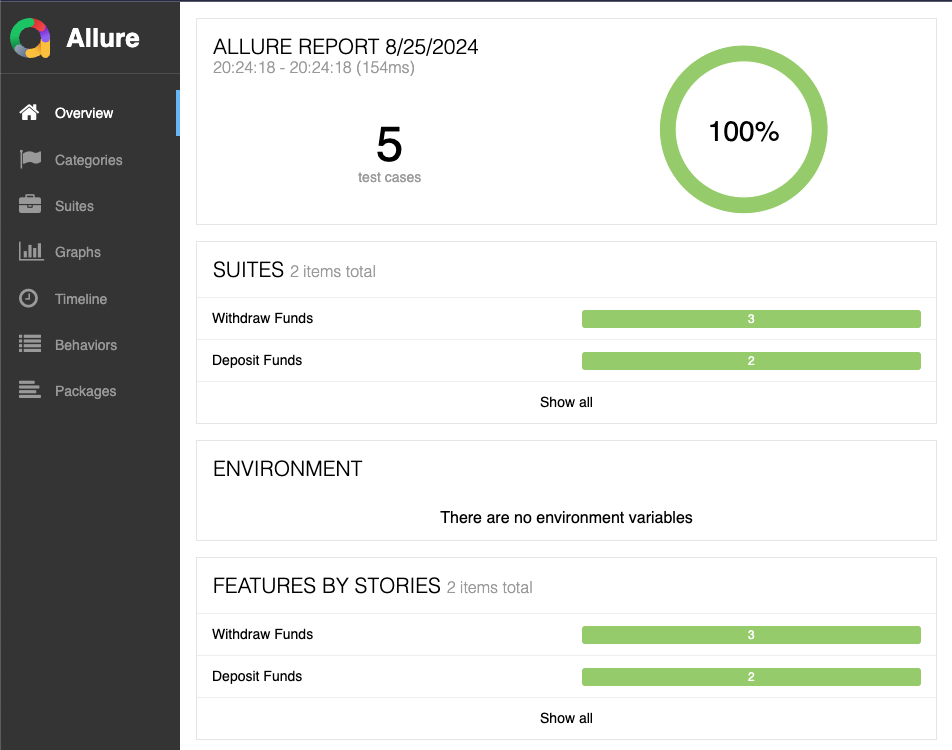

# qa-backend-code-challenge

Code challenge for QA Backend Engineer candidates.

### Build Docker image

Run this command from the directory where there is the solution file.

```
docker build -f src/Betsson.OnlineWallets.Web/Dockerfile .
```

### Run Docker container

```
docker run -p <port>:8080 <image id>
```

### Open Swagger

```
http://localhost:<port>/swagger/index.html
```

### Running unit tests:

```
dotnet test src/Betsson.OnlineWallets/Betsson.OnlineWallets.UnitTests/Betsson.OnlineWallets.UnitTests.csproj --collect:"XPlat Code Coverage"
```

Generate code coverage report:

1. First install dotnet-reportgenerator-globaltool:

```
dotnet tool install -g dotnet-reportgenerator-globaltool
```

2. Run command to generare html file for unit test coverage:

```
reportgenerator -reports:"src/Betsson.OnlineWallets/Betsson.OnlineWallets.UnitTests/TestResults/{{add-uuid-here}}/coverage.cobertura.xml" -targetdir:"coveragereport" -reporttypes:Html
```

You will be able to see coveragereport folder created and open index.html file



### Api Testing

Api testing solution will be generating an Allure Report after finishing the execution you have to have Allure commandline installed:

```
https://allurereport.org/docs/install/
```

After running the API tests normally with dotnet test the report needs to be generated using the results, in Betsson.OnlineWallets.Api.Tests folder just follow the steps:

### Running the API tests project:

First check if you are running the Online Wallet on the same host and port as configured there:

```
{
    "OnlineWallet": {
        "BaseUrl": "http://localhost:5047"
    }
}
```

For feature pipeline implementation we can create an appsettings.local.json and setup the host and port accordingly, for now Github Actions is using appsettings

After checking the host and port you will be able to run the API automation:

```
dotnet test src/Betsson.OnlineWallets.Api.Tests/Betsson.OnlineWallets.Api.Tests.csproj
```

### After running the API tests you will be able to serve or generate Allure Report:

```
allure serve src/Betsson.OnlineWallets.Api.Tests/bin/Debug/net8.0/allure-results
```

```
allure generate src/Betsson.OnlineWallets.Api.Tests/bin/Debug/net8.0/allure-results
```


